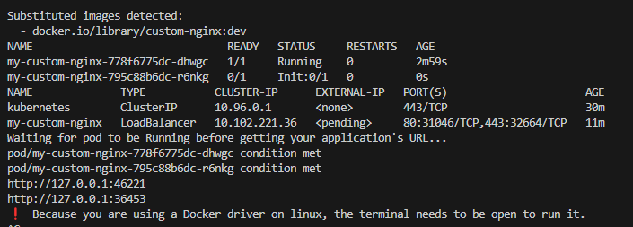

# Automatically deploy your custom web app on Kubernetes using Helm and Docker
## Pre-requirements
For this demo, due to limitations in what can be done with minikube we will be using a single-node cluster. So if you have configured a minikube cluster with more, delete it and restart it with:
```bash
minikube delete --all #remove cluster
minikube start --driver=docker --cni calico #create single node cluster
``` 
# 1- If you want Maximum automation - Just run this
```bash
sh deploy_nginx_helm.sh
```

## Outputs from 1
The command will output the URL of your app (starts with 127.0.0.1, click on it):


You'll then be taken to a website you can explore:


# 2- If you want to configure and enjoy the process


Start by installing helm and setting up denpendencies:
```bash
sh install-dependencies.sh
```


Build docker image:
```bash
sh build_docker_image.sh # will output an image called custom-nginx
```


Enable local docker registry usage in minikube:
```bash
eval $(minikube docker-env) 
```

Deploy the application to our Kubernetes cluster:
```bash
sh deploy_nginx.sh
```

# How it was made

- Copied the files from bitnami/nginx Helm deployment, to edit them locally. They can be found in /nginx.
- Created custom html for our website in custom-nginx/
- Created a Dockerfile copying our custom html to the base Nginx Docker image.
- Changed value in nginx/values.yaml to reference our image:
    ```yaml
    image:
    registry: docker.io
    repository: library/custom-nginx
    tag: dev
    digest: ""
    ```
- Light debugging and success


